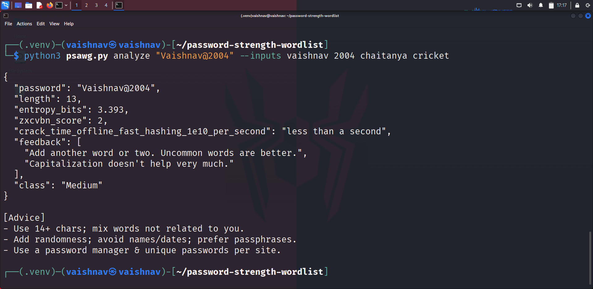
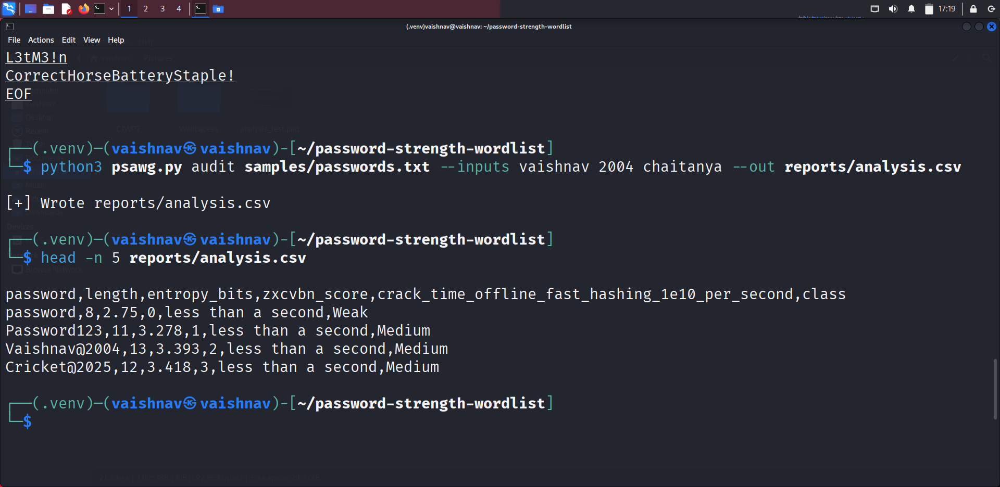
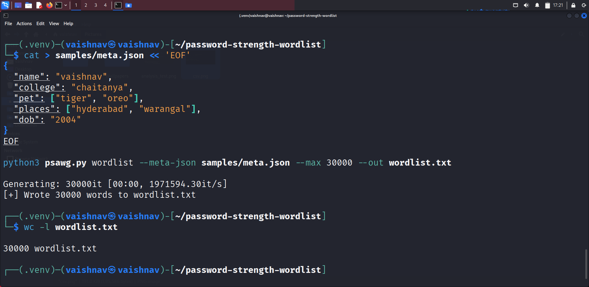

# Password Strength Analyzer & Custom Wordlist Generator (PSAWG)

A Python CLI that:
- **Analyzes** password strength (entropy + ZXCVBN score & crack-time)
- **Audits** a list of passwords to CSV
- **Generates** custom wordlists from user metadata (case, leetspeak, separators, suffixes, years)

## Setup

```bash
python3 -m venv .venv
source .venv/bin/activate
pip install --upgrade pip
pip install zxcvbn tqdm

##Usage

1.Analyze one password
----------------------
python3 psawg.py analyze "Vaishnav@2004" --inputs vaishnav 2004 chaitanya cricket

2.Audit many passwords
----------------------
python3 psawg.py audit samples/passwords.txt --inputs vaishnav 2004 chaitanya --out reports/analysis.csv

3.Generate a custom wordlist
----------------------------
python3 psawg.py wordlist --meta vaishnav 2004 chaitanya cricket hyderabad --max 30000 --out wordlist.txt
# or from JSON:
python3 psawg.py wordlist --meta-json samples/meta.json --max 30000 --out wordlist.txt

##Output
--------

-analyze prints JSON with length, entropy_bits, zxcvbn_score (0–4), crack-time, and a class (Weak/Medium/Strong).

-audit writes reports/analysis.csv.

-wordlist writes wordlist.txt (size controlled by --max).


## Screenshots

### Password Analysis


### Audit CSV


### Wordlist Generation

